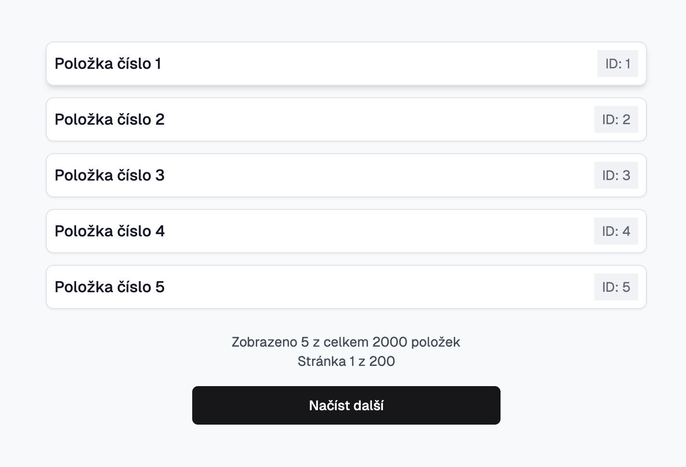

# Zadání k pohovoru (Next.js + TypeScript)

Cílem zadání není ani tak finální funkční výsledek, jako spíše prověřit vaši schopnost kriticky uvažovat, strukturovaně komunikovat a ukázat, že skutečně rozumíte principům použitého kódu. Sledujeme, jak přistupujete k rozdělení úkolu, jak formulujete dotazy, vysvětlujete své rozhodnutí a reagujete na případné komplikace – to vše je pro nás cennější než dokonalý „hotový" komponent.

**AI nástroje jsou povolené a očekávané.** Používejte Cursor, Claude Code, Copilot — cokoliv, s čím běžně pracujete. Zajímá nás, jak AI řídíte, ne jestli ho používáte.

## Setup

```bash
git clone https://github.com/impact-solutions-dev/interview-nextjs.git
cd interview-nextjs
pnpm install
pnpm dev
```

## Úkol 1 — Komponenta `InfiniteList`

Vytvořte komponentu, která zobrazí seznam položek z API a umožní postupné načítání dalších.

- Tech stack: Next.js, TypeScript
- Můžete využívat jakékoli knihovny, ale ze zkušenosti doporučujeme plain React.
- Využijte React hooks (např. `useState`, `useEffect`) a `fetch` pro získávání dat.



### API endpoint

- **URL**: `/api/items?page=<číslo stránky>`
- **Parametry**:
  - `page` (number) – číslo stránky, výchozí 1
- **Response** (JSON):

```ts
{
  items: {
    id: number;
    title: string;
  }[];
  page: number;            // aktuální stránka
  totalPages: number;      // počet všech stránek
  itemsPerPage: number;    // počet položek na stránku (10)
  totalItems: number;      // celkový počet položek (1000)
}
```

### Chování komponenty

- Po prvním načtení stránky zobrazte položky `items`.
- Pod seznamem položek zobrazte tlačítko **„Načíst další"**.
- Po kliknutí na tlačítko se z API načtou další položky a vloží se pod již načtené existující položky.

### Bonus (volitelně)

- Přidejte scrollování po načtení.
- Dejte tlačítku stav `disabled`, když jste na poslední stránce.
- Přidejte jednoduchý loading indicator během načítání.
- Využijte Server Components.

---

## Úkol 2 — Databáze

Momentálně API vrací data z pole v paměti. Přepište to tak, aby položky žily v databázi. V repozitáři je připravený libsql in-memory setup (`db/index.ts`). Při startu serveru se DB naplní seed daty.

---

## Úkol 3 — Mazání položek

Uživatel chce mít možnost smazat položku přímo ze seznamu. Po smazání by položka měla zmizet okamžitě, ne až po refreshi.

---

## Úkol 4 — Vyhledávání

Nad seznamem by měl být input, do kterého uživatel píše a seznam se filtruje. Filtrování by mělo probíhat na straně serveru (v DB), ne v prohlížeči.

---

## Úkol 5 — Kategorie

Položky patří do kategorií (např. „Hardware", „Software", „Služby"). Přidejte kategorii ke každé položce a umožněte filtrování podle kategorie. Jak to bude vypadat v DB a v UI je na vás.

---

## Úkol 6 — Editace inline

Kliknutím na položku se její název stane editovatelným. Po potvrzení se změna uloží do DB. Ošetřete, co se stane, když uložení selže.

---

## Úkol 7 — Řazení

Uživatel chce mít možnost seřadit položky podle názvu nebo data vytvoření. Řazení by mělo fungovat nad celým datasetem, ne jen nad načtenými položkami.

---

## Úkol 8 — Stav v URL

Když uživatel filtruje, vyhledává nebo se nachází na určité pozici v seznamu, mělo by být možné zkopírovat URL a poslat ji kolegovi — kolega uvidí stejný stav.